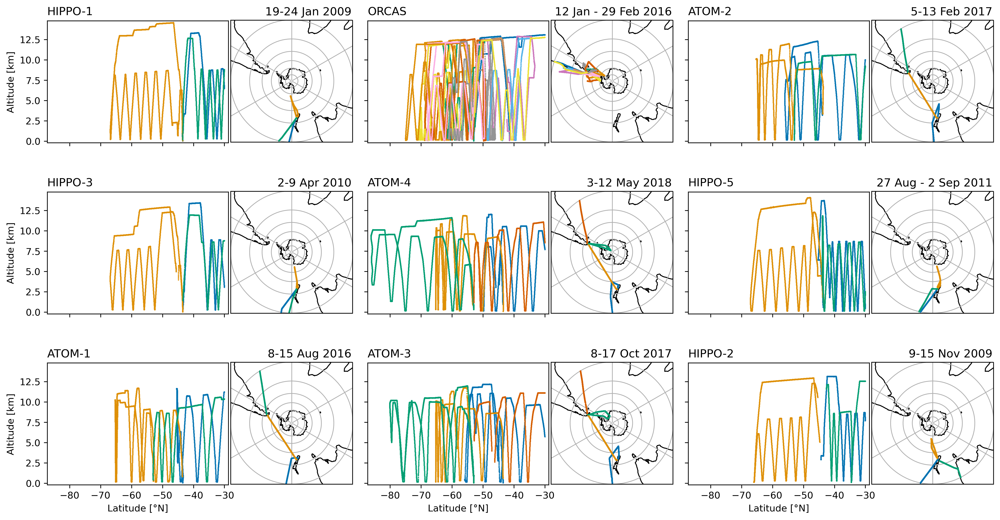
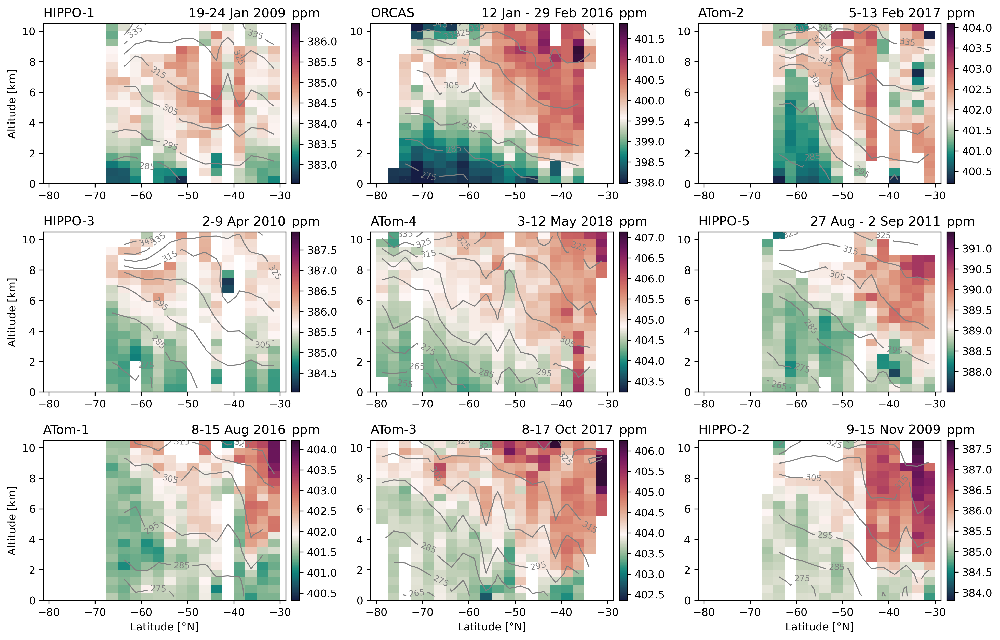
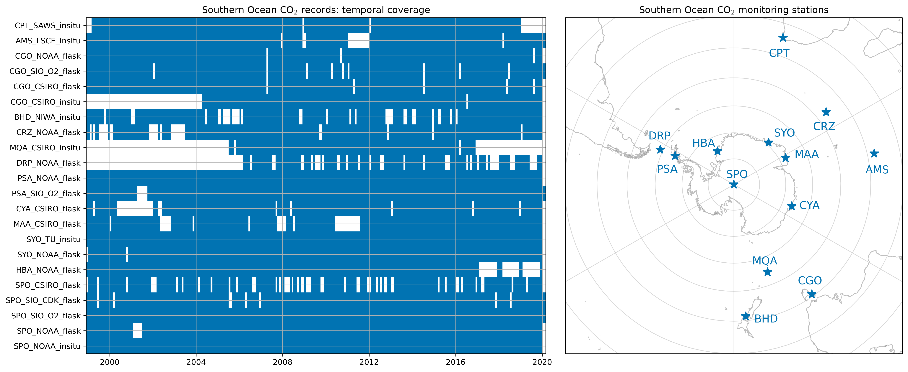
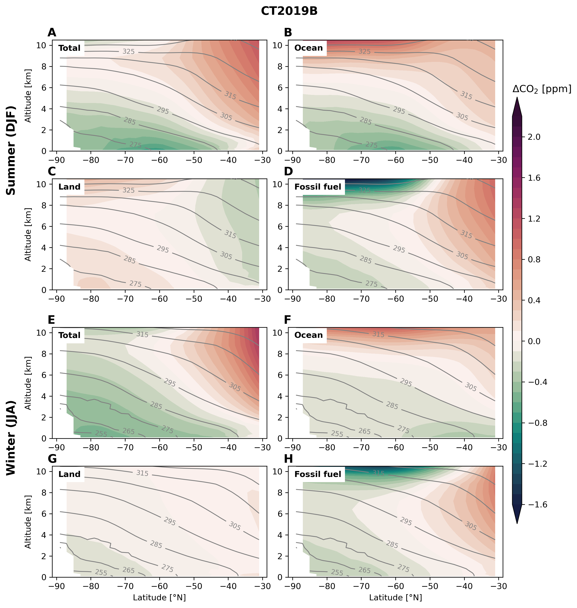
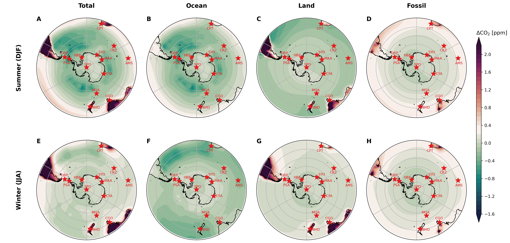
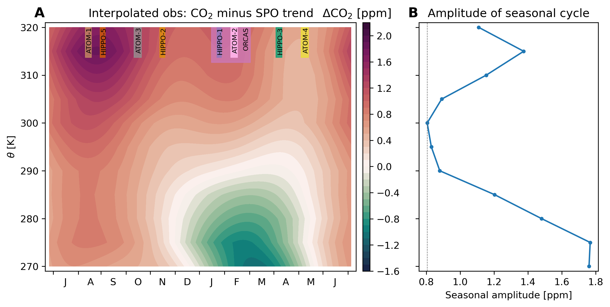
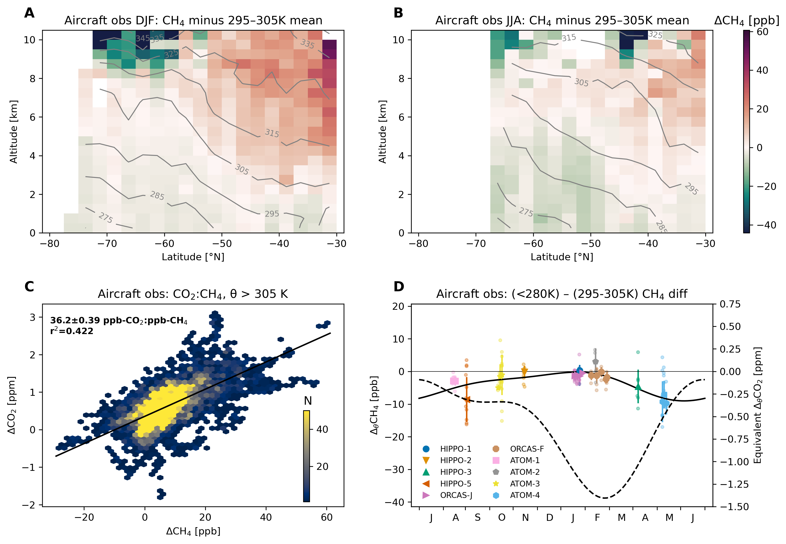
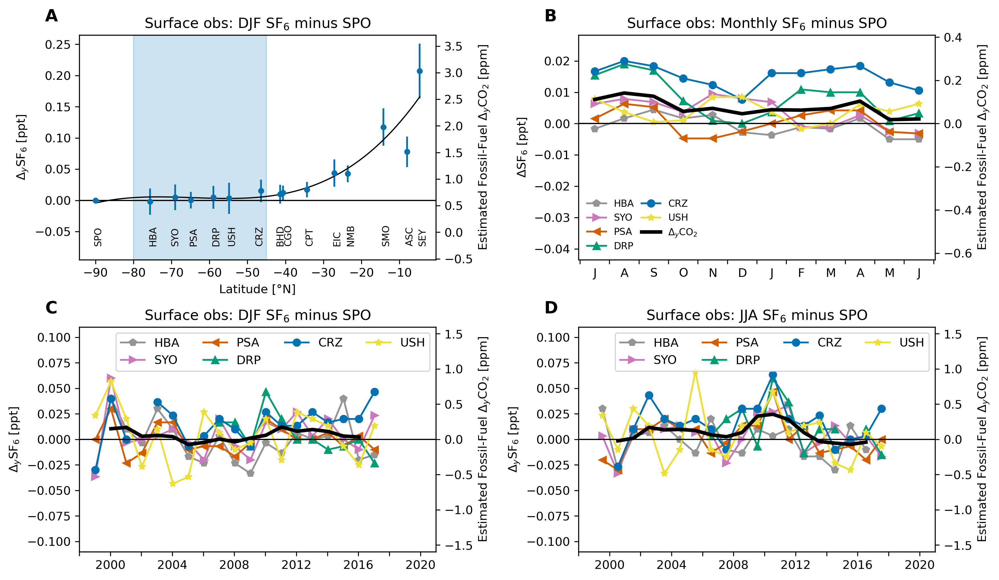

# Southern Ocean Air-Sea Carbon Fluxes from Aircraft Observations: Analysis code

Matthew C. Long and Britton B. Stephens

This book documents the analysis underpinning {cite:t}`Long-Stephens-etal-2021`:

> M. C. Long, B. B. Stephens, K. McKain, C. Sweeney, R. F. Keeling, E. A. Kort, E. J. Morgan, J. D. Bent, N. Chandra, F. Chevallier, R. Commane, B. C. Daube, P. B. Krummel, Z. Loh, I. T. Luijkx, D. Munro, P. Patra, W. Peters, M. Ramonet, C. Rödenbeck, A. Stavert, P. Tans, S. C. Wofsy, Strong Southern Ocean carbon uptake evident in airborne observations, *Science* (2021), https://doi.org/10.1126/science.abi4355.


## Summary

The Southern Ocean plays an important role in determining atmospheric CO<sub>2</sub>, yet estimates of air-sea CO<sub>2</sub> flux for the region diverge widely.
Here we present an analysis in which we estimate Southern Ocean air-sea CO<sub>2</sub> fluxes using aircraft observations of atmospheric CO<sub>2</sub>.
Using a collection of transport models, we "calibrate" a relationship between the flux and the lower-troposphere vertical CO<sub>2</sub> gradient over the Southern Ocean.
Using data from aircraft campaigns conducted over 2009–2018, we find a Southern Ocean flux of –0.53±0.23 Pg C yr<sup>–1</sup> (net uptake) south of 45°S.
We also examine the use of surface-based atmospheric CO<sub>2</sub> measurements.
The horizontal gradients captured by these observations do not provide as robust constraints on the fluxes as the vertical gradients accessible from aircraft.
However, the inferences from surface observations are consistent with the aircraft-based flux estimates, and suggest a trend of increasing Southern Ocean uptake since 2005.


## Citation

Please cite {cite:t}`Long-Stephens-etal-2021` for the results of this research: 

```bibtex
@article{Long-Stephens-etal-2021,
  author={M. C. Long and B. B. Stephens and K. McKain and C. Sweeney and R. F. Keeling and E. A. Kort and E. J. Morgan and J. D. Bent and N. Chandra and F. Chevallier and R. Commane and B. C. Daube and P. B. Krummel and Z. Loh and I. T. Luijkx and D. Munro and P. Patra and W. Peters and M. Ramonet and C. Rödenbeck and A. Stavert and P. Tans and S. C. Wofsy},
  year={2021}, 
  journal={Science},
  title={Strong {Southern Ocean} Carbon Uptake Evident in Airborne Observations},
  doi={10.5065/6vnv-1x08}
}
```


If you are interested in explicitly citing this book, please use the following citation.

> M.C. Long, B. B. Stephens, Southern Ocean Air-Sea Carbon Fluxes from Aircraft Observations: Analysis code, National Center for Atmospheric Research (2021), https:/doi.org/10.5065/6vnv-1x08.


```bibtex
@book{Long-Stephens-code-2021,
  title={Southern Ocean Air-Sea Carbon Fluxes from Aircraft Observations: Analysis code},
  author={Long, Matthew C. and Stephens, Britton B.},
  publisher={National Center for Atmospheric Research},
  url={https://ncar.github.io/so-co2-airborne-obs},
  doi={10.5065/6vnv-1x08},
  year={2021}
}
```

## Main document

### Structure of variability in atmospheric carbon dioxide

We examined the structure of atmospheric CO<sub>2</sub> variability over the Southern Ocean in observations collected by [aircraft](aircraft-obs) and at [surface monitoring stations](surface-obs).
These data demonstrated surface drawdown in the lower troposphere during summer and relatively homogenous distributions during winter.

{numref}`Fig1` shows these patterns for two selected airborne transects and a collection of surface monitoring stations.
The code to produce this figure is [here](./obs-main.ipynb).

```{figure} figures/Fig-1-co2-aircraft-surface-obs.png
---
name: Fig1
align: left
---
**Observed patterns in atmospheric CO<sub>2</sub> over the Southern Ocean.** Observed patterns in atmospheric CO<sub>2</sub> over the Southern Ocean. Upper panels: Cross-sections observed by aircraft during (A) ORCAS, Jan–Feb 2016 and (B) ATom-1, Aug 2016. Colors show the observed CO<sub>2</sub> dry air mole fraction relative to the average observed within the 295–305 K potential temperature range south of 45°S on each campaign; contour lines show the observed potential temperature.
Fight-tracks and cross-section plots for all campaigns are shown [here](obs-aircraft.ipynb) and [this notebook](obs-simulated-distributions.ipynb) illustrates the distributions of CO<sub>2</sub> simulated by a 3-D transport model.
Lower panels: Compilation of mean CO<sub>2</sub> observed at surface monitoring stations minus the NOAA in situ record at the South Pole Observatory (SPO) over 1999–2019 for (C) summer (DJF) and (D) winter (JJA). 
The black line is a spline fit provided simply as a visual guide. Blue shading denotes the latitude band in which we designate “Southern Ocean stations.” Station locations and temporal coverage are shown [here](obs-surface.ipynb).
```

###  Gradient metrics to isolate ocean influence

To isolate CO<sub>2</sub> gradients driven by Southern Ocean fluxes, we examined CO<sub>2</sub> anomalies relative to a local reference, using potential temperature ($\theta$) to delineate boundaries in the vertical.

#### Defining gradient metrics

##### ''Vertical'' gradient metric 
$\begin{align}
\Delta_{\theta}\mathrm{CO}_2 = 
\left<\mathrm{CO}_2\right>_{\theta<280\mathrm{K}} - 
\left<\mathrm{CO}_2\right>_{295\mathrm{K}<\theta<305\mathrm{K}}
\end{align}$

where $\left<\cdot\right>$ is the median value of $\mathrm{CO}_2$ in the specified $\theta$ (potential temperature) range.


##### Horizontal gradient metric
$\begin{align}
\Delta_{y}\mathrm{CO}_2 = 
\left|\mathrm{CO}_2\right|_{\mathrm{So Ocn}} - 
\mathrm{CO}_2^{\mathrm{SPO}}
\end{align}$

where $\left|\mathrm{CO}_2\right|_{\mathrm{So Ocn}}$ is the mean across stations in the core latitudes of summertime $\mathrm{CO}_2$-drawdown and $\mathrm{CO}_2^{\mathrm{SPO}}$ is the value at the South Pole Observatory (SPO).

In addition to observations, we leveraged a [collection of atmospheric transport models](models).

{numref}`Fig2` below shows the seasonal evolution of gradient metric as reconstructed from observations and models. The code to produce this figure is [here](./gradients-main.ipynb).

```{figure} figures/Fig-2-metrics-seasonal-cycle.png
---
name: Fig2
align: left
---
**Seasonal evolution of atmospheric CO<sub>2</sub> over the Southern Ocean.** (A) Vertical profiles of CO<sub>2</sub> observations collected by aircraft south of 45°S, binned on 5 K potential temperature (θ) bins and averaged by season (whiskers show standard deviation). (B) The vertical gradient ($\Delta_{\theta}\ce{CO}_2$) in CO<sub>2</sub> measured from aircraft south of 45°S. Small points show $\Delta_{\theta}\ce{CO}_2$ for individual profiles; larger points show the median and standard deviation (whiskers) for each flight. The black line shows a two-harmonic fit to the flight-median points. (C) Monthly climatology (1999–2019) of the latitudinal gradient in CO<sub>2</sub> measured by surface stations ([Fig 1](obs-main.ipynb)); the black line shows the station mean metric ($\Delta_{y}\ce{CO}_2$). Separate laboratory records at SYO and PSA have been averaged. The seasonal evolution of (D) $\Delta_{\theta}\ce{CO}_2$ and (E) $\Delta_{y}\ce{CO}_2$ simulated in a collection of atmospheric inverse models. The points show the median across the models, whiskers show the standard deviation; the colors correspond to the “total” CO<sub>2</sub> (black), and CO<sub>2</sub> tracers responsive to only ocean (blue), land (green), and fossil (red) surface fluxes. Note that the <i>y</i>-axis bounds differ by panel.
```

Several other lines of evidence were used to justify these gradient metrics. 
For example, we examined the [seasonal evolution of CO<sub>2</sub> in the column](Fig-S07), finding a minimum amplitude at 300 K.

### Emergent constraints on air-sea CO<sub>2</sub> flux

To develop quantitative flux estimates, we
related simulated $\Delta_{\theta}\mathrm{CO}_2^{ocn}$ and $\Delta_{y}\mathrm{CO}_2^{ocn}$ to regionally integrated, temporally averaged air-sea flux in the modeling systems.
By applying observed estimates of each gradient metric, we can use the relationship across the models as an "emergent constraint" on regional fluxes.
{numref}`Fig3` shows these relationships for both aircraft and surface data, including representative observations of the gradient metrics.
The code to produce this figure is [here](./emergent-constraint.ipynb).

```{figure} figures/Fig-3-emergent-constraint-ocean_constraint.png
---
name: Fig3
width: 800px
align: left
---
**Emergent constraints on air-sea fluxes south of 45°S.** Upper panels: 90-day-mean air-sea fluxes south of 45°S versus ∆θCO<sub>2</sub>ocn from model simulations (see SM) replicating aircraft observations collected during (A) Dec-Feb and (B) Mar-Nov. Colored vertical lines show an observed value of $\Delta_{\theta}\ce{CO}_2$ (ORCAS during Jan in panel “A” and ATom-1 in panel “B”) corrected for land and fossil-fuel influence, with shading indicating both analytical uncertainty and model spread in the correction; colored points highlight the model samples from these particular campaigns, while gray points show data from other campaigns in the (A) Dec–Feb or (B) Mar–Nov timeframe. Figures S10 and S11 show similar plots for each individual aircraft campaign. Lower panels: Seasonal-mean surface fluxes versus ∆yCO<sub>2</sub>ocn computed from models for (C) summer (DJF) and (D) winter (JJA) over 1999–2019. Points correspond to individual models; whiskers denote the standard deviation of interannual variability. Light blue vertical lines show the observed ∆yCO<sub>2</sub> corrected for land and fossil fuel influence; shading shows analytical uncertainty and model spread in the correction (see SM; Fig. S12A, B show ∆yCO<sub>2</sub> time series). The sign convention for fluxes is positive upward. Diagonal lines, where significant, show the best-fit line to all data points shown: inset text shows an estimate of the slope with standard error (SM); goodness-of-fit statistics are also shown. Table S3 provides detailed information on the model products, defining the acronyms used in the legend. Note that the axis bounds differ by panel. See Figure S16 for a version of this plot based on total CO<sub>2</sub>.
```

### Observationally-based estimates of Southern Ocean air-sea fluxes 
Ultimately, we were able to leverage the emergent constraints shown in {numref}`Fig3` estimate fluxes over the seasonal cycle. 
{numref}`Fig4` presents a summary of the flux estimates developed in this study. 
The code to produce this figure is [here](./fluxes.ipynb).


```{figure} figures/Fig-4-fluxes-ocean_constraint.png
---
name: Fig4
align: left
---
**Observationally-based estimates of Southern Ocean air-sea fluxes.** (A) The seasonal cycle of air-sea CO<sub>2</sub> flux south of 45°S estimated from aircraft campaigns (black points, labels), plotted at the center of the 90-day window for which the emergent flux constraint was calibrated; whiskers show the standard deviation derived from propagating analytical and statistical uncertainties; the black line shows a two-harmonic fit used to estimate the annual mean flux. The colored lines give the seasonal cycle from atmospheric inversion systems as well as the neural-network extrapolation {cite:p}`Landschutzer2016-wg` of the Surface Ocean CO<sub>2</sub> Atlas (“SOCAT”) pCO<sub>2</sub> observations {cite:p}`Bakker2016-tt` and profiling-float observations from the Southern Ocean Carbon and Climate Observations and Modeling (SOCCOM) project {cite:p}`Johnson2017-al`. Fluxes are averaged over 2009–2018, except for the three neural-network based flux estimates {cite:p}`Landschutzer2019-mr` incorporating SOCCOM observations, which are averaged over 2015–2017. (B) Annual mean flux estimated in this study (leftmost bar) including uncertainty (whisker), along with the mean and standard deviation (whiskers) across the inversion systems shown in panel “A” as well as the surface-ocean pCO<sub>2</sub>-based methods; averaging time-periods are noted in the axis labels (both SOCAT flux estimates were derived using neural-network training over the full observational period). The uncertainty estimate on the SOCAT and SOCCOM fluxes is approximated from {cite:t}`Bushinsky2019-ha`, who report ±0.15 Pg C yr<sup>-1</sup> as the “method uncertainty” associated with the neural-network-based flux estimates for the whole Southern Ocean (south of 44°S). Note that while s99oc_v2020 and s99c_SOCAT+SOCCOM_v2020 are global inversions, their ocean fluxes are prescribed, not optimized using atmospheric observations; similarly, the CAMS(v20r1) ocean fluxes remain close to its SOCAT pCO<sub>2</sub>-based prior.
```

## Supplemental information

(aircraft-obs)=
### Aircraft observations
We use observations from nine deployments of three recent aircraft projects: the HIAPER Pole-to-Pole Observations (HIPPO) project {cite:p}`Wofsy2011-zm`; the O<sub>2</sub>/N<sub>2</sub> Ratio and CO<sub>2</sub> Airborne Southern Ocean (ORCAS) study {cite:p}`Stephens2018-be`; and the Atmospheric Tomography (ATom) mission {cite:p}`Wofsy2018-oo`. 

#### A decade of aircraft observations


**Flight tracks for each of the aircraft campaigns used in this analysis.** Individual flights are plotted in different colors with the date ranges of the plotted flights included in the title; the campaigns are ordered by month. 
The code to produce this figure is [here](./obs-aircraft.ipynb).


#### Repeat observations of CO<sub>2</sub> cross-section


**Cross-sections of CO<sub>2</sub> (colors) and potential temperature (θ, contour lines) for each of the aircraft campaigns used in this study.** The panels are arranged by month with the dates of the survey included in the title. Each panel has its own colorbar centered on the average of CO<sub>2</sub> measured within 295 K < θ < 305 K, south of 45°S on each section; the colorbars all span 13.7 ppm. The ORCAS (top middle) and ATOM-1 (bottom left) cross-sections are similar to Figure 1 in the main text of the paper, where we show CO<sub>2</sub> with the mid-troposphere reference subtracted.
The code to produce this figure is [here](./obs-aircraft.ipynb).

(surface-obs)=
### Surface observations
We also examined 44 atmospheric CO<sub>2</sub> records from surface monitoring stations in the high-latitude Southern Hemisphere, selecting and filtering the highest quality data. [This table](./table-s1.md) include information on the records we used.

#### Long-term monitoring of surface CO<sub>2</sub>


**Temporal coverage (left) and location (right) of measurements** at Southern Ocean CO2 monitoring stations used in this study. See also this [table](./table-s1.md).
The code to produce this figure is [here](./obs-surface.ipynb).


### Models
We leverage a collection of atmospheric inversions models that simulate time-varying, three-dimensional CO<sub>2</sub> fields sampled to replicate these observations.
The atmospheric inversion models explicitly simulate CO<sub>2</sub> tracers responsive only to ocean $(\ce{CO}_2^{ocn})$, land $(\ce{CO}_2^{lnd})$ and fossil fuel $(\ce{CO}_2^{ff})$ fluxes and subject to identical transport fields.

(models)=
#### Atmospheric inversion models

| Model                      | Model Name                               | Grid<br>(lon x lat x lev) | Transport Model | Meteor-<br>ology | References                                  |
| -------------------------- | ---------------------------------------- | ------------------------- | --------------- | ---------------- | ------------------------------------------- |
| CT2017                     | NOAA CarbonTracker                       | 3 x 2° x 25              | TM5             | ERA-Interim      | Peters et al. (73)                          |
| CT2019B                    | NOAA CarbonTracker                       | 3° x 2° x 25              | TM5             | ERA-Interim      | Jacobson et al. (72)                        |
| CTE2018                    | CarbonTracker Europe                     | 3° x 2° x 25†               | TM5             | ERA-Interim      | van der Laan-Luijkx et al. (74)             |
| CTE2020                    | CarbonTracker Europe                     | 3° x 2° x 25†               | TM5             | ERA5             | van der Laan-Luijkx et al. (74)             |
| s99oc\_v2020               | Jena CarboScope                          | 4° x 5° x 19                | TM3             | NCEP             | Rodenbeck et al. (75); Rödenbeck (76)       |
| s99oc\_ADJocI40S\_v2020    | Jena CarboScope                          | 4° x 5° x 19                | TM3             | NCEP             | Rodenbeck et al. (75); Rödenbeck (76)       |
| s99oc\_SOCAT+SOCCOM\_v2020 | Jena CarboScope                          | 4° x 5° x 19                | TM3             | NCEP             | Rodenbeck et al. (75); Rödenbeck (76)       |
| CAMS(v20r1)                | Copernicus Atmosphere Monitoring Service | 3.75° x 1.875° x 39         | LMDZ6A          | ERA5             | Chevallier et al. (77, 78); Chevallier (79) |
| MIROC4-ACTM-2020           | MIROC4-ACTM                              | 2.8° x 2.8° x 67          | MIROC4-ACTM     | JRA-55           | Patra et al. (80); Saeki and Patra (81)     |
| TM5+Flux                   | Transport Model 5                        | 3° x 2° x 25              | TM5             | ERA-Interim      | Landschützer et al. (27) 

#### Simulated zonal cross-section


**Zonal-mean cross sections of CO2 tracers from CarbonTracker (CT2019B)** for (A–D) summer (Dec–Jan) and (E–H) winter (Jun–Aug). Colors show the simulated CO2 dry air mole fraction relative to the average simulated within the 295–305 K potential temperature range between 45°–80°S; contour lines show the simulated potential temperature. The model represents multiple CO2 tracers, each responsive to selective surface-flux boundary conditions: the “total” tracer sees the sum of ocean, land and fossil fuel fluxes (panels A and E), while individual tracers only see one of these flux components.
The code to produce this figure is [here](./obs-simulated-distributions.ipynb).

#### Simulated surface distributions


**Maps of seasonal-mean surface simulated CO2 minus that at the South Pole Observatory (SPO) in CT2019B.** (A–D) summer (Dec–Feb) and (E–H) winter (Jun–Aug). Colors show the simulated CO2 dry air mole fraction relative to that simulated at SPO. The model represents multiple CO2 tracers, each responsive to selective surface-flux boundary conditions: the “total” tracer sees the sum of ocean, land and fossil fuel fluxes (panels A and E), while individual tracers only see one of these flux components, shown in the three right columns.
The code to produce this figure is [here](./obs-simulated-distributions.ipynb).


### Gradient definitions

(Fig-S07)=
#### Observed variation of CO<sub>2</sub> in the column


**Seasonal variation of CO<sub>2</sub> over the Southern Ocean from aircraft observations.** (A) The data were binned in 5 K potential temperature (θ) bins and a deseasonalized fit to CO<sub>2</sub> observations at the South Pole Observatory (SPO) was removed, enabling combining observations collected over several years in the presence of a strong increasing CO<sub>2</sub> trend. The plot shows a two-harmonic periodic function fit to data within each θ bin; the seasonal timing of the nine aircraft deployments is illustrated by vertical bars at the top of the plot. (B) The amplitude of seasonal variation in CO<sub>2</sub> in 5 K θ bins, derived from panel A. The gray vertical line highlights the minimum in seasonal amplitude, found at the bin centered on 300 K.
The code to produce this figure is [here](./gradients-seasonal-amplitude.ipynb).

(Fig-S08)=
#### Methane
Methane distribution demonstrate that the vertical gradient is not sensitive to extra-regional influence from land or fossil fuel emissions.



**Observed concentrations and gradients of methane (CH<sub>4</sub>)** south of 45°S using data from the Harvard QCLS instrument on HIPPO and the NOAA Picarro instrument on ORCAS and ATom. Seasonally-averaged cross-sections observed by aircraft during (A) austral summer (DJF) and (B) austral winter (JJA). Colors show the observed CH4 dry air mole fraction relative to the average observed within the 295–305 K potential temperature range south of 45°S on each campaign; contour lines show the observed potential temperature. (C) Upper troposphere (θ > 305 K) binned observations of CO2 versus CH4 from all campaigns; color shows the number of 10-sec observations in each bin; the campaign-average concentration measured within 295 K < θ < 305 K has been subtracted from each tracer. The black line shows the best-fit relationship computed using Orthogonal Distance Regression; inset text shows an estimate of the slope with standard error. We excluded stratospheric samples where H2O < 50 ppm and either O3 > 150 ppb or N<sub>2</sub>O (detrended to a reference year of 2009) < 319 ppb (49). (D) The vertical gradient (∆θCH4) in CH<sub>4</sub> measured from aircraft. The ∆θCH4 metric is defined as the difference between CH4 observed where θ < 280 K and 295–305 K, south of 45°S. Small points show the gradient on individual profiles; the larger points show the median gradient for each flight, with whiskers representing the standard deviation of profiles on each flight. The righthand y-axis shows an estimate of the expected equivalent gradient in CO<sub>2</sub>, using the slope of the relationship shown in panel C. The dashed line is the two-harmonic fit to observations of ∆θCO2, replicated from Fig 2B in the main text.
The code to produce this figure is [here](./gradients-methane.ipynb).


(Fig-S09)=
#### Sulfur hexafluoride
Similarly, SF<sub>6</sub> distributions indicate that the horizontal gradient is dominated by ocean influence.

**Meridional distribution and seasonal cycle of sulfur hexafluoride (SF6) in the Southern Hemisphere** from NOAA surface monitoring stations (1999–2020). (A) December–February (DJF) mean and standard deviation of SF6 concentrations minus SF6 at South Pole Observatory (SPO) as a function of latitude. See Table S1 for station identification. Blue shading denotes the latitude band in which we designate “Southern Ocean stations,” as in Fig 1. (B) Seasonal cycle of SF6 from station records south of 45°S relative to SF6 observed at SPO. Time evolution of SF6 over the Southern Ocean (south of 45°S) minus SF6 at SPO in (C) summer and (D) winter; black line shows the mean across stations with a 3-year running-mean applied. The righthand y-axes show an estimate of the expected equivalent gradient in fossil-fuel CO2, using a ratio of 14.5 ppm CO2:ppt SF6 (see Supplementary Text). SF6 data were obtained from https://gml.noaa.gov/aftp/data/trace_gases/sf6/flask/surface.
The code to produce this figure is [here](./gradients-sf6.ipynb)
